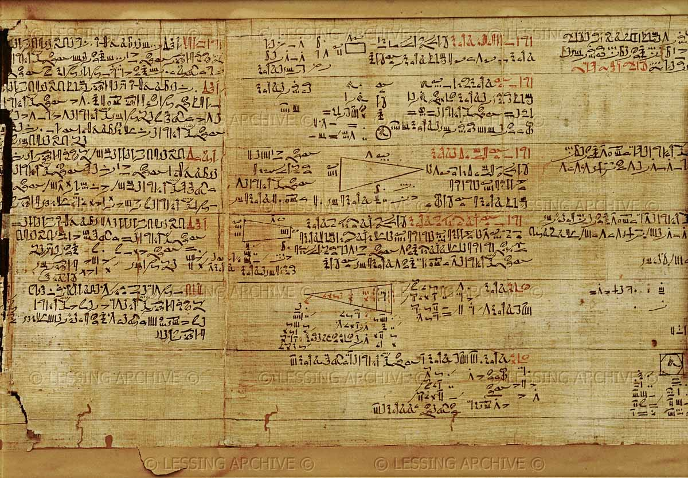
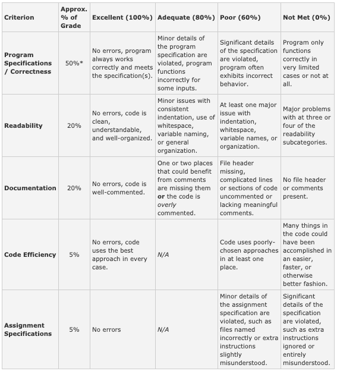

# Fraction Calculator
### Due: 11/18/2020

## Introduction:
The objective of this assignment is to create a calculator to compute arithmetic operations between integers and/or fractions and output the result as a reduced mixed fraction.

## Specifications:
* Input will be in the form of a value, followed by an arithmetic operator, and then another value. Values and operators will be separated by a single space. Values will contain no spaces.

* Input values may be in the form of mixed fractions, proper fractions, improper fractions or integers. The integer and fraction parts of a mixed fraction will be separated by an underscore (e.g., “1_3/4” is one and three fourths to distinguish it from “13/4” which is thirteen fourths).

* The calculator will support the 4 basic arithmetic operations: add (+), subtract (-), multiply (\*), and divide (/).

* The program should accept an expression, calculate the result in the proper form, print it to screen, and then be ready to accept another expression. The user should be able to exit the program by entering the command “quit" instead of an expression.

* See the examples section below for clarification.

## Output:
The output value must always be reduced and never improper (it may be an integer, fraction, or mixed fraction, as appropriate). Example: a result of 10/4 should be printed to the screen as 2_1/2).

## Examples:
| Input          | Output       | Notes                                       |
| :------------- | :----------: | :------------------------------------------ |
| 1/4 + 1_1/2    | 1_3/4        | Input may be a mixed number.                |
| 8/4 + 2        | 4            | Input may be an improper fraction.          |
| -1 * -1/2      | 1/2          | Input may be negative.                      |
| 0 * 25_462/543 | 0            | Remember to check for border/special cases. |

## Code Organization:
You must organize your code in the following way to receive credit for your project.  If you deviate from this, your unit tests will fail, and significant points will be deducted from your grade.
* You must complete the implementation for the following method, inside your FracCalc.java file:   
`public static String produceAnswer(String input)`
  This method receives a single line of user input as its parameter (for example, “3_1/2 + 1/4"), and returns the answer (for example, “3_3/4”).  This method does not print anything!

* Your `main()` method must use a Scanner to receive input from the user, call produceAnswer with that input, and then print the answer that was returned by produceAnswer.  Your main method eventually is responsible for repeatedly reading input from the user, calling `produceAnswer()`, printing the result, and ending once the user types “quit”, although in the first checkpoint only one line of input needs to be read, with a single response printed to the console.

* Your code must pass the unit tests for the checkpoint you’re submitting.  If all the tests fail, that is a sign your code is organized incorrectly.  Fix before submitting to us.

## Checkpoints:
There will be 3 checkpoints to ensure that the calculator is on track for completion. They are required, and are worth a substantial part of your grade. You must submit them on time to receive full credit.

* Checkpoint 1: Parsing one line of input **(Due by end of day, TUESDAY 11/03)**
  * Your `main()` method creates a Scanner, reads one line of input, and passes that input to `produceAnswer`.

  * `produceAnswer` breaks up that line of input into three Strings: the first operand (fraction), the operator (+ - * /), and the second operand (fraction).  Each of these Strings should be stored in variables inside `produceAnswer`.  

  * `produceAnswer` returns the second operand.  For example, produceAnswer(“1_2/3 + 4_5/6”) returns “4_5/6”.

  * `main()` prints the result returned by `produceAnswer`.

* Checkpoint 2: Multiple lines of input, parsing fractions **(Due by beginning of class, MONDAY 11/09)**
  * Your `main()` method now accepts input from the user multiple times (until the user types “quit”).

  * For each line of input, main calls `produceAnswer()` and prints the returned result.

  * This time, `produceAnswer` must further parse each operand into 3 integer variables, one each for the numerator, denominator, and whole portion (for mixed fractions or integers).  Note that there are cases where not all 3 of these components are present.

  * `produceAnswer` now must demonstrate you have parsed fractions properly by returning a string that describes each component of the second operand: the whole number portion (or 0 if not specified), the numerator (or 0 if not specified), and the denominator (or 1 if not specified).  Examples:
    * `produceAnswer("5_3/4 - 6_5/8")` returns "whole:6 numerator:5 denominator:8"

    * `produceAnswer("-3/7 - 20")` returns "whole:20 numerator:0 denominator:1"

    * `produceAnswer(“-32 - 27/21”)` returns "whole:0 numerator:27 denominator:21"

* Checkpoint 3: Evaluation **(Due by end of day, FRIDAY 11/13)**
  * `produceAnswer` must now evaluate the formula it is given (performing addition, subtraction, multiplication, and division, based on the operator specified), and return the actual answer of that calculation (instead of just returning the second operand).

  * The answer need not be reduced, and need not be a mixed fraction.  But it must be correct.

  * All kinds of input values the user might enter must be accepted, including simple fractions, improper fractions, mixed fractions, and integers.

* Final Project: All requirements complete
  * All answers must be reduced

  * All tests should pass

## Extra Credit:
Do not spend time on extra credit until you have everything else working properly.

* Multiple Operations

  * This extra credit will be awarded for calculators that can take in arbitrarily many values and operators. This will only be tested with compatible expressions such that all expressions are evaluated from left to right, in the order they appear (i.e. you will not need to worry about order of operations).

  | Input                 | Output          |
  | :-------------------- | :-------------: |
  | 1 + 2 + 3             | 6               |
  | -1/2 * 4 + 3/4        | -1_1/4          |
  |5_3/4 - -6_8/8 - 5_3/4 | 7               |

* Error Handling
  * This extra credit will be awarded for calculators that do not crash when erroneous input is provided, but instead print useful error messages.  Any error encountered based on user input should print “ERROR: ” to the screen followed by an informative error message.

  | Input          | Output                                |
  | :------------- | :------------------------------------ |
  | 1/0 + 1        | ERROR: Cannot divide by zero.         |
  | 1 ++ 2         | ERROR: Input is in an invalid format. |

## Rubric:

